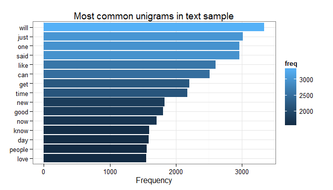
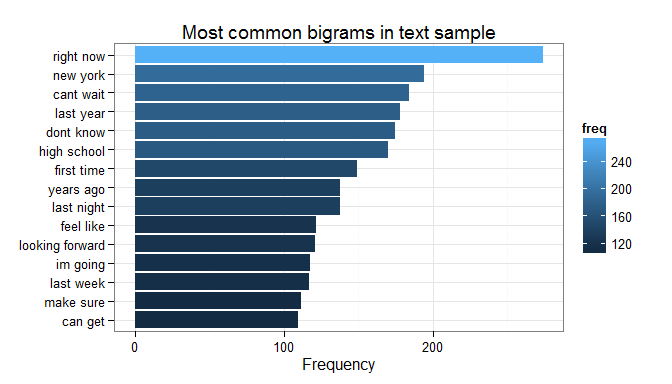
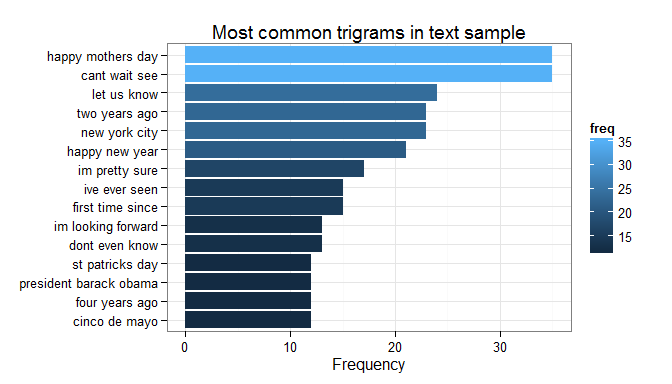
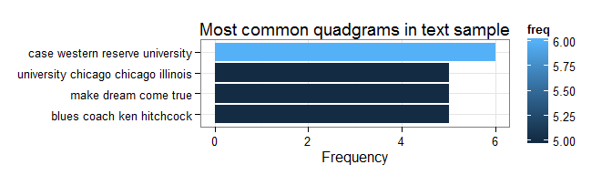

# Milestone Report for Coursera Data Science Specialization SwiftKey Capstone

### Executive summary
This milestone report for the Data Science Capstone project provides a summary of data preprocessing and exploratory data analysis of the data sets provided. Plans for creating the prediction algorithm and the Shiny app will also be discussed.


```r
library(tm)
```

```
## Warning: package 'tm' was built under R version 3.1.3
## Warning: package 'NLP' was built under R version 3.1.3
```

```r
library(RWeka)
```

```
## Warning: package 'RWeka' was built under R version 3.1.3
```

```r
library(stringi)
```

```
## Warning: package 'stringi' was built under R version 3.1.3
```

```r
library(stringr)
library(ggplot2)
library(dplyr)
```

### Data description and summary statistics
In this project, the following data is provided.


```r
# specify the source and destination of the download
destination_file <- "Coursera-SwiftKey.zip"
source_file <- "http://d396qusza40orc.cloudfront.net/dsscapstone/dataset/Coursera-SwiftKey.zip"

# execute the download
download.file(source_file, destination_file)

# extract the files from the zip file
unzip(destination_file)
```

Text documents are provided in English, German, Finnish and Russian and they come in three different forms: blogs, news and twitter. In this project, we are interested in the three forms of data in English. We first load the data.


```r
file1 <- file("./final/en_US/en_US.blogs.txt", "rb")
blogs <- readLines(file1, encoding="UTF-8")
close(file1)

file2 <- file("./final/en_US/en_US.news.txt", "rb")
news <- readLines(file2, encoding="UTF-8")
close(file2)

file3 <- file("./final/en_US/en_US.twitter.txt", "rb")
twitter <- readLines(file3, encoding="UTF-8")
```

```
## Warning: line 167155 appears to contain an embedded nul
## Warning: line 268547 appears to contain an embedded nul
## Warning: line 1274086 appears to contain an embedded nul
## Warning: line 1759032 appears to contain an embedded nul
```

```r
close(file3)
```

A summary statistics is given below:

```r
words_blogs <- stri_count_words(blogs)
words_news <- stri_count_words(news)
words_twitter <- stri_count_words(twitter)
size_blogs <- file.info("final/en_US/en_US.blogs.txt")$size/1024^2
size_news <- file.info("final/en_US/en_US.news.txt")$size/1024^2
size_twitter <- file.info("final/en_US/en_US.twitter.txt")$size/1024^2
summary_table <- data.frame(filename = c("blogs","news","twitter"),
                            file_size_MB = c(size_blogs, size_news, size_twitter),
                            num_lines = c(length(blogs),length(news),length(twitter)),
                            num_words = c(sum(words_blogs),sum(words_news),sum(words_twitter)),
                            mean_num_words = c(mean(words_blogs),mean(words_news),mean(words_twitter)))
summary_table
```

```
##   filename file_size_MB num_lines num_words mean_num_words
## 1    blogs        200.4    899288  37541795          41.75
## 2     news        196.3   1010242  34762303          34.41
## 3  twitter        159.4   2360148  30092866          12.75
```

### Data preprocessing
We will randomly choose 1% of each data set to demonstrate data preprocessing and exploratory data analysis. The full dataset will be used later in creating the prediction algorithm.


```r
set.seed(1)
blogsSample <- sample(blogs, length(blogs)*0.01)
newsSample <- sample(news, length(news)*0.01)
twitterSample <- sample(twitter, length(twitter)*0.01)
twitterSample <- sapply(twitterSample, 
                        function(row) iconv(row, "latin1", "ASCII", sub=""))
```

We combine the three samples. The number of lines and total number of words are as follows:

```r
text_sample  <- c(blogsSample,newsSample,twitterSample)
length(text_sample) #no of lines
```

```
## [1] 42695
```

```r
sum(stri_count_words(text_sample))
```

```
## [1] 1019959
```


The basic procedure for data preprocessing consists of the following key steps:

1. Construct a corpus from the files.

2. Tokenization. Clean up the corpus by removing special characters, punctuation, numbers etc. We also remove profanity that we do not want to predict.

3. Build basic n-gram model.

We will require the following helper functions in order to prepare our corpus.


```r
toSpace <- content_transformer(function(x, pattern) gsub(pattern, " ", x))
preprocessCorpus <- function(corpus){
    # Helper function to preprocess corpus
    corpus <- tm_map(corpus, toSpace, "/|@|\\|")
    corpus <- tm_map(corpus, content_transformer(tolower))
    corpus <- tm_map(corpus, removeNumbers)
    corpus <- tm_map(corpus, removePunctuation)
    corpus <- tm_map(corpus, removeWords, stopwords("english"))
    corpus <- tm_map(corpus, removeWords, profanities)
    corpus <- tm_map(corpus, stripWhitespace)
    return(corpus)
}

freq_frame <- function(tdm){
    # Helper function to tabulate frequency
    freq <- sort(rowSums(as.matrix(tdm)), decreasing=TRUE)
    freq_frame <- data.frame(word=names(freq), freq=freq)
    return(freq_frame)
}

BigramTokenizer <- function(x) NGramTokenizer(x, Weka_control(min=2, max=2))
TrigramTokenizer <- function(x) NGramTokenizer(x, Weka_control(min=3, max=3))
QuadgramTokenizer <- function(x) NGramTokenizer(x, Weka_control(min=4, max=4))
```

We preprocess the text sample to form Term Document Matrices.


```r
text_sample <- VCorpus(VectorSource(text_sample))
text_sample <- preprocessCorpus(text_sample)

tdm1a <- TermDocumentMatrix(text_sample)
tdm1 <- removeSparseTerms(tdm1a, 0.99)
freq1_frame <- freq_frame(tdm1)

tdm2a <- TermDocumentMatrix(text_sample, control=list(tokenize=BigramTokenizer))
tdm2 <- removeSparseTerms(tdm2a, 0.999)
freq2_frame <- freq_frame(tdm2)

tdm3a <- TermDocumentMatrix(text_sample, control=list(tokenize=TrigramTokenizer))
tdm3 <- removeSparseTerms(tdm3a, 0.9999)
freq3_frame <- freq_frame(tdm3)

tdm4a <- TermDocumentMatrix(text_sample, control=list(tokenize=QuadgramTokenizer))
tdm4 <- removeSparseTerms(tdm4a, 0.9999)
freq4_frame <- freq_frame(tdm4)
```

### Exploratory analysis
For each Term Document Matrix, we list the most common unigrams, bigrams, trigrams and fourgrams.


```r
#wordcloud(freq1_frame$word, freq1_frame$freq, min.freq=200)
ggplot(freq1_top15, aes(x=reorder(word,freq), y=freq, fill=freq)) +
    geom_bar(stat="identity") +
    theme_bw() +
    coord_flip() +
    theme(axis.title.y = element_blank()) +
    labs(y="Frequency", title="Most common unigrams in text sample")
```

 

```r
ggplot(freq2_top15, aes(x=reorder(word,freq), y=freq, fill=freq)) +
    geom_bar(stat="identity") +
    theme_bw() +
    coord_flip() +
    theme(axis.title.y = element_blank()) +
    labs(y="Frequency", title="Most common bigrams in text sample")
```

 

```r
ggplot(freq3_top15, aes(x=reorder(word,freq), y=freq, fill=freq)) +
    geom_bar(stat="identity") +
    theme_bw() +
    coord_flip() +
    theme(axis.title.y = element_blank()) +
    labs(y="Frequency", title="Most common trigrams in text sample")
```

 


```r
ggplot(freq4_top15, aes(x=reorder(word,freq), y=freq, fill=freq)) +
    geom_bar(stat="identity") +
    theme_bw() +
    coord_flip() +
    theme(axis.title.y = element_blank()) +
    labs(y="Frequency", title="Most common quadgrams in text sample")
```

 

## Prediction strategies and plans for Shiny app
While the strategy for modeling and prediction has not been finalized, the n-gram model with a frequency look-up table might be used based on the analysis above. A possible method of prediction is to use the 4-gram model to find the most likely next word first. If none is found, then the 3-gram model is used, and so forth. Furthermore, stemming might also be done in data preprocessing.

For the Shiny app, the plan is to create an app with a simple interface where the user can enter a string of text. Our prediction model will then give a list of suggested words to update the next word.
